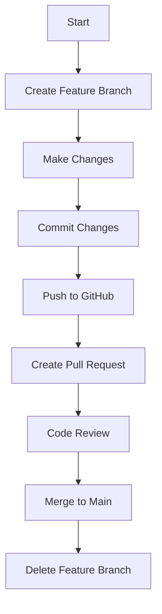

# 🧭 PortfolioCRM Developer Guide

## 📦 Project Structure

The project is organized into the following main directories:

- `CRM.PL`: The ASP.NET Core Web API project
- `CRM.BLL`: The business logic layer
- `CRM.DAL`: The data access layer

## 📋 Recommended Git Workflow Strategy
**GitHub Flow (Recommended for Startups)**
**Best for:** Small teams, continuous deployment, MVP development
```
main (production-ready)
  ↓
  ├── feature/backend-inquiry-management
  ├── feature/backend-project-api
  ├── feature/frontend-contact-form
  └── feature/frontend-project-list
```

**Advantages:**

* ✅ Simple and easy to understand
* ✅ Fast development cycle
* ✅ Perfect for 3-person team
* ✅ Easy code review process
* ✅ Continuous deployment friendly

## 🏗️ Repository Structure
**Recommended Approach: Monorepo**
```
PortfolioCRM/
├── backend/
│   ├── PortfolioCRM.API/
│   ├── PortfolioCRM.BLL/
│   ├── PortfolioCRM.DAL/
│   └── PortfolioCRM.sln
├── frontend/
│   ├── src/
│   ├── angular.json
│   ├── package.json
│   └── tsconfig.json
├── docs/
│   ├── developer_guide.md
└── README.md
```

**Why Monorepo?**

* ✅ Easier to keep backend/frontend in sync
* ✅ Single source of truth
* ✅ Shared documentation
* ✅ Atomic commits across backend/frontend
* ✅ Simpler CI/CD pipeline

## 🌿 Branch Strategy

### **Main Branches:**

1. **`main`** (or `master`)
   - Production-ready code
   - Always deployable
   - Protected branch (requires PR approval)
   - Auto-deploys to production (optional)

2. **`develop`** (optional for larger teams)
   - Integration branch
   - For 3-person team: **Skip this, use `main` only**

### **Feature Branches:**

```bash
# Backend Features
feature/backend-inquiry-crud
feature/backend-authentication
feature/backend-project-management
feature/backend-file-upload

# Frontend Features
feature/frontend-home-page
feature/frontend-contact-form
feature/frontend-project-gallery
feature/frontend-admin-dashboard

# Bug Fixes
fix/backend-inquiry-validation
fix/frontend-mobile-responsive

# Hotfixes
hotfix/critical-security-patch
```

### **Branch Naming Convention:**

```
<type>/<scope>-<description>

Types:
- feature/   → New feature
- fix/       → Bug fix
- hotfix/    → Critical production fix
- docs/      → Documentation only
- refactor/  → Code refactoring
- test/      → Adding tests

Examples:
✅ feature/backend-inquiry-api
✅ fix/frontend-mobile-menu
✅ hotfix/database-connection
❌ my-branch (too vague)
❌ updates (not descriptive)
```

---

## 📝 Workflow Steps

### **For Each Feature/Task:**

```mermaid
1. Pull latest main
   ↓
2. Create feature branch
   ↓
3. Make changes & commit
   ↓
4. Push to GitHub
   ↓
5. Create Pull Request
   ↓
6. Code Review
   ↓
7. Merge to main
   ↓
8. Delete feature branch
```

### **Detailed Steps:**

**Developer A (Backend - You):**
```bash
# 1. Start fresh
git checkout main
git pull origin main

# 2. Create feature branch
git checkout -b feature/backend-inquiry-api

# 3. Work on feature...
# Make changes to InquiryController.cs

# 4. Commit changes
git add .
git commit -m "feat(backend): add inquiry CRUD endpoints"

# 5. Push to GitHub
git push origin feature/backend-inquiry-api

# 6. Create Pull Request on GitHub

# 7. After merge, cleanup
git checkout main
git pull origin main
git branch -d feature/backend-inquiry-api
```

**Developer B (Backend):**
```bash
# Works on different feature simultaneously
git checkout main
git pull origin main
git checkout -b feature/backend-authentication

# Work... commit... push... PR... merge
```

**Developer C (Frontend):**
```bash
# Works on frontend independently
git checkout main
git pull origin main
git checkout -b feature/frontend-contact-form

# Work... commit... push... PR... merge
```

---

## 🔄 Daily Workflow

### **Morning (Start of Day):**
```bash
# 1. Update your main branch
git checkout main
git pull origin main

# 2. Create/switch to your feature branch
git checkout -b feature/your-task
# OR if branch exists:
git checkout feature/your-task
git merge main  # Get latest changes
```

### **During Development:**
```bash
# Commit frequently (every logical change)
git add .
git commit -m "descriptive message"

# Push to backup your work
git push origin feature/your-task
```

### **End of Day:**
```bash
# Push all changes
git add .
git commit -m "work in progress: task description"
git push origin feature/your-task
```

### **When Feature is Complete:**
```bash
# 1. Ensure all changes are committed
git status  # Should be clean

# 2. Update from main
git checkout main
git pull origin main
git checkout feature/your-task
git merge main  # Resolve conflicts if any

# 3. Push final version
git push origin feature/your-task

# 4. Create Pull Request on GitHub
```

---

## 💬 Commit Message Convention

### **Format:**
```
<type>(<scope>): <subject>

<body> (optional)

<footer> (optional)
```

### **Types:**
- `feat` - New feature
- `fix` - Bug fix
- `docs` - Documentation changes
- `style` - Formatting, missing semicolons, etc.
- `refactor` - Code refactoring
- `test` - Adding tests
- `chore` - Maintenance tasks

### **Examples:**

```bash
✅ Good Commits:
git commit -m "feat(backend): add inquiry CRUD endpoints"
git commit -m "fix(frontend): resolve mobile menu overflow"
git commit -m "docs: update API documentation"
git commit -m "refactor(backend): improve AutoMapper configuration"
git commit -m "test(backend): add inquiry service unit tests"

❌ Bad Commits:
git commit -m "updates"
git commit -m "fixed stuff"
git commit -m "changes"
git commit -m "WIP"
```

### **Multi-line Commit (for complex changes):**
```bash
git commit -m "feat(backend): implement project management API

- Add ProjectController with CRUD operations
- Implement project publishing workflow
- Add AutoMapper configuration for ProjectDTOs
- Create unit tests for ProjectService

Closes #123"
```
## 🧠 Code Review Process

**Pull Request Template:**
```
## Description
Brief description of changes

## Type of Change
- [ ] Feature
- [ ] Bug fix
- [ ] Refactor
- [ ] Docs update

## How to Test
1. Run backend API
2. Open Angular app
3. Verify feature behavior

## Checklist
- [ ] Builds successfully
- [ ] No sensitive data
- [ ] Coding standards followed
- [ ] Tests (if applicable)
```
**Guidelines:**

* PRs must be reviewed within 24 hours
* Only the Lead merges to main
* Use comments, not direct pushes, to request changes

## 💬 Communication & Coordination

Use WhatsApp/Discored for quick updates:

```
"Starting feature/backend-authentication"
"Pushed PR for review: feature/backend-authentication"
"Feature merged — please pull main"
```

**Daily standup points:**

* What I worked on
* What I’m working on today
* Any blockers

## 🔒 Branch Protection Rules
**On GitHub (Settings → Branches):**
**For main branch:**

* ✅ Require pull request reviews (at least 1)
* ✅ Require status checks to pass
* ✅ Require branches to be up to date
* ✅ Include administrators (everyone follows rules)

**This ensures:**

* No direct pushes to main
* All code is reviewed
* Quality control

## 🔒 .gitignore File
**Create `.gitignore` in repository root:**
```
# Ignore all files in the docs directory
docs/
```
**Why?**
* ✅ Prevent documentation from being committed
* ✅ Prevent sensitive data from being committed
* ✅ Prevent build artifacts from being committed

## 📊 Workflow Diagram


<p align="center">
  
</p>


---

## 📚 Additional Resources

- **Git Cheat Sheet:** [github.com/training/git-cheat-sheet](https://training.github.com/downloads/github-git-cheat-sheet/)
- **GitHub Flow:** [guides.github.com/introduction/flow](https://guides.github.com/introduction/flow/)
- **Semantic Versioning:** [semver.org](https://semver.org/)
- **Conventional Commits:** [conventionalcommits.org](https://www.conventionalcommits.org/)

---